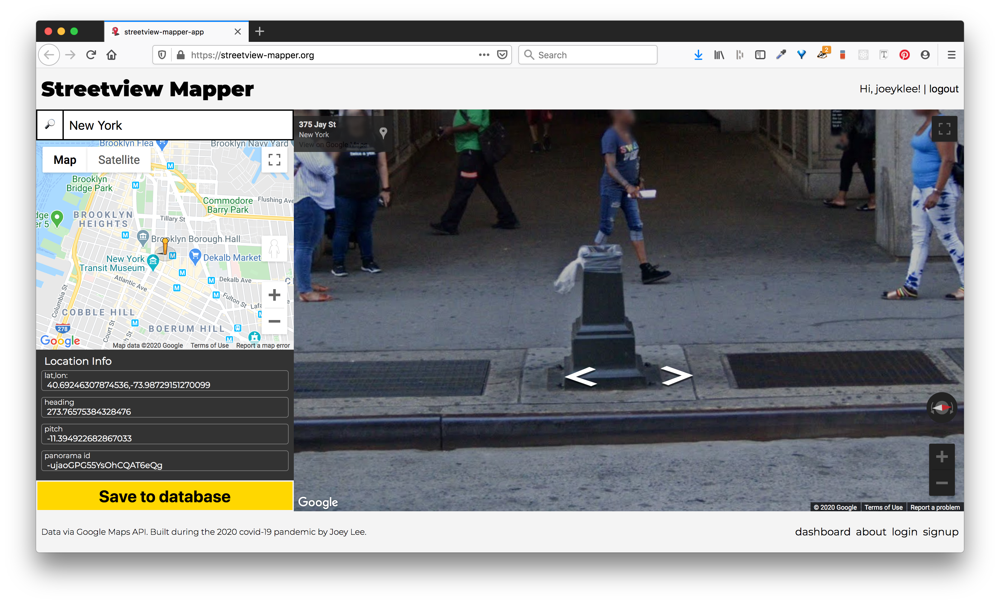
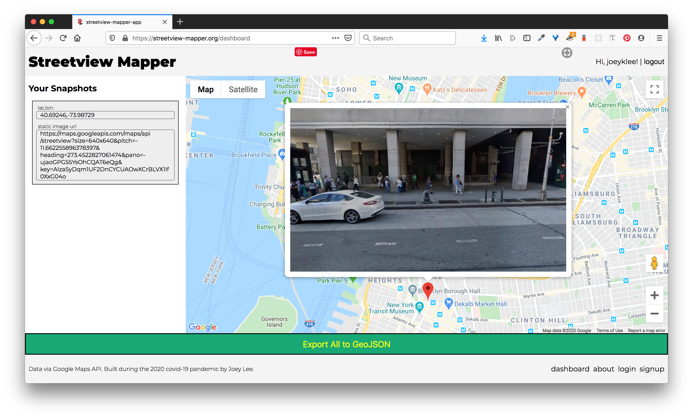

# Welcome to the Streetview Mapper Documentation Page
> Streetview Mapper is a simple tool to allow curious mappers (like you!) to take «snapshots» of the world through Google Streetview. These snapshots are stored in a database to allow users to revisit what things they've found remarkable, noteworthy, strange, funny, weird, and compelling. 

Hello! If you're here, you're probably looking to get started using the [Streetview Mapper](https://streetview-mapper.org). If so, you're in the right place!

## About

[Streetview Mapper](https://streetview-mapper.org/) is a simple tool to allow curious mappers (like you!) to take «snapshots» of the world through Google Streetview. These snapshots are stored in a database to allow people to revisit what things they've found remarkable, noteworthy, strange, funny, weird, and compelling in one way or another. 

This is a project by [Joey Lee](https://jk-lee.com) built this during the 2020 covid-19 pandemic.

For his course «All Maps Lie» at New York University's Interactive Telecommunication Program (ITP), Joey's students were supposed to perform their own «Data Walks», physically collecting data about the urban environment and infrastructure. However given the need to stay indoors, it was necessary to find other mechanisms to observe the world, explore spatial media, and practice paying attention. This tool was developed out of this need to provide other ways to explore and observe the world.

Please report bugs or issues on Github. Thank you!
* → [joeyklee/streetview-mapper-docs](https://github.com/joeyklee/streetview-mapper-docs/issues). 

### How it works

#### Capture "Snapshots"

Using the [Streetview Mapper](https://streetview-mapper.org/), you can "travel around" using Google's Streeview service and take a snapshot of what you see. The geolocation and the details of the Google Streetview scene are stored in addition to any description or notes you add to the submission. 

#### Review

Using the Streetview Mapper Dashboard, you can see all the snapshots you've made. You can click on the markers to reveal the snapshot you made and export your data to [GeoJSON]() - an open geospatial data format - to use in other applications and projects. 

In the future, more features might be added to do more extensive data editing, filtering and grouping, and general data exploration, but for now, the dashboard is a simple interface to see what street views you've collected.

### Additional Reflections 

On one hand, Streetview is just tool. It allows people to remotely «visit» a place they've never been to. It gives people a chance to familiarize themselves with a «blank spot on the map» and to get a better sense of key landmarks that might aid in navigating in a new place. It provides an incredible service, allowing us to «go into the map» and see the world through the lenses of Google Users and the Google Streetview Car and Backpack. 

On the other hand, Google Streetview provides one of the most extensive windows into urban life. Using Streetview, people can see places near and far. People can see things they may have never seen before. And perhaps most interesting, people can see in a way that is beyond our own human capabilities (360 views). It is in these *ways of seeing* where there's so much to explore. Many Streetview scenes are seemingly mundane. Many scenes are of people walking on the sidewalk, cars stuck in traffic, trees and grass, and birds flying in the sky. Aside from the occasional Streetview performance (from people who notice that they are being photographed), what Streetview shows might seem pretty unremarkable; it's basically what we might see on an "average" walk, drive, or bike-ride. What Streetview prompts us to explore is *what is average*? Is an average day a beautiful sunny day or is it rather cloudy, overcast? Is the "average" something to be desired? Is it that the "average" provides the most utility? By capturing the "average" what are we leaving out? 

By exploring Streetview and using a tool to collect the "experiences" of many streetview mappers, I'm curious to see what amusing/critical/surprising/shared/unique/playful/heartwarming/shocking/hopeful observations might start to emerge. I hope this tool can provide a means to unpack what Streetview means to us and how it shapes how we see the world.

Lastly, since we're all stuck inside right now, I hope this might be a means to be #mappingInTheTimeOfCorona. 

## Acknowledgements

Many thanks to NYU's ITP Program, the ITP Community, and the [Humans-in-Residence Fellowship](https://tisch.nyu.edu/itp/itp-people/faculty/somethings-in-residence-sirs). 

Special thanks to my students in «All Maps Lie 2020».

The project is built with ❤️ by [Joey Lee](https://jk-lee.com) using [Vue.js](https://vuejs.org/), the GoogleMaps API, Node.js/Express.js, and MongoDB. The service is served up using [Netlify](https://www.netlify.com/), Heroku, and MongoDB Atlas.

## Signup

Before you can start using the [Streetview Mapper](https://streetview-mapper.org), you'll have to sign up with the following items:

| ✅ | Item | Description | Notes |
| :---- | --- | --- | --- |
| ☑️ | username | A username you want to be displayed publicly | required |
| ☑️ | email | An email address you will use to log-in publicly | required |
| ☑️ | password | A password that is at least 7 characters long.  | required |
| ☑️ | Google Maps API Key  | In order to use the Streetview Mapper, you'll need to make a Google Maps API Key with these features enabled 1) **Google Maps JavaScript API**, 2) **Places API**, and 3) **Street View Static API** | required |

⚠️ You will need to [Make a Google Maps API Key](#making-a-google-maps-api-key) before you can sign up. Please follow the instructions below 👇👇👇

## Making a Google Maps API Key

In order to make a Google Maps API Key for use with the Streetview Mapper you will need to create one. For the savy folks, you can probably figure out how to do this by reading [Google's instructions on how to get an API key](https://developers.google.com/maps/documentation/javascript/get-api-key), but for everyone else, I will step you through how to do this.

### Step-by-step

1. Make an google account and sign-in. 
2. Navigate to this link to the [Google Cloud Platform](https://console.cloud.google.com/google/maps-apis/). You'll have to agree to the terms of service and set your country.
   
3. Create a project. Let's call this: `streetview-mapper`
   
   
4. You'll end up on a screen with all these Google Maps features. So many things!
   
5. Remember, we need to enable: 1) **Google Maps JavaScript API**, 2) **Places API**, and 3) **Street View Static API**. In order to do this, you can:
   1. Click on the square card with the API of interest then,
      
   2. Click **Enable** where prompted.
      
   3. Go back to the api list:
      
      and select from the list
      
   4. Repeat Steps 5.1 - 5.3 for the **Places API** 
      
   5. Repeat Steps 5.1 - 5.3 for the **Street View Static API** 
      
6. If you completed step 5 correctly, then you should see all those APIs enabled:
    
7. Use the sidebar dropdown (the 3 lines that look like a hamburger) to navigate to: > **APIs & Services** > **Credentials**
   
8. Create an API Key & then select **Restrict Key**
   
   Select **restrict key**: note that I've hidden my key
   
9. **Scroll down** and restrict your API Keys by selecting them in the dropdown menu:
   * Select: Places API
     
   * Select:  Google Maps API
     
   * Select: Streetview API
     
   * Finally your keys will be restricted to those 3 APIs => **SAVE**
     
10. Now copy your API Key from your Google Cloud Console
    * **Copy your Key**
      
    * **Paste it** into the Signup page of Streetview Mapper
      

## Privacy & Terms of Service

Dear Streetview Mapper,
My name is Joey Lee. I'm a [Adjunct Professor at New York University](https://tisch.nyu.edu/itp/itp-people/faculty/somethings-in-residence-sirs/joseph-lee) and a [Creative Technologist](https://jk-lee.com) based in Brooklyn, New York. I'm not a corporation or commercial entity trying to profit or make any money by providing this application and service. The Streetview Mapper DOES NOT USE ANY of your information whatsoever for anything besides allowing you to login to the application and create data as part of the service. Period. 

That being said, I do reserve the right to stop the service at any point without warning. I will try my best to keep Streetview Mapper alive as long as possible, but unfortunately I cannot make any guarantees. 

I'm glad you're interested to use the app!

## Supporting & Funding the Project

If you'd like to provide a few dollars to help with server costs and database hosting, I'd be psyched! This will help with the longevity of the project and also help ensure all your data collections can get a nice back up every once in a while. 

| feature | cost | 
| :--- | --- | 
| Domain hosting for "streetview-mapper.org" | `$20/year` | 
| Server Hosting | `$7/month` or `$84/month` | 
| Database Services | `TBD` | 

In total I might expect a conservative estimate: ~**$120.00**/year

Feel free to reach out via email if you'd like to support the project: joeyklee@nyu.edu

